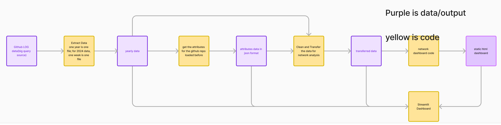
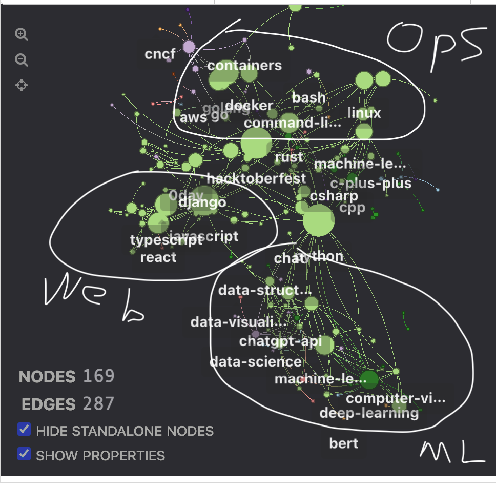

**Don't Look at code in demos and notebooks folder, the code is just for my testing and it is very messy**

The purpose of the project is to do a network analysis on github repos. For instance, whether there are some clusters regarding the topics the repos are about and how these clusters relate to each other.

This is the flow of the pipeline

Below is a demo work. You can see react, djangom typescript repos are closer.

